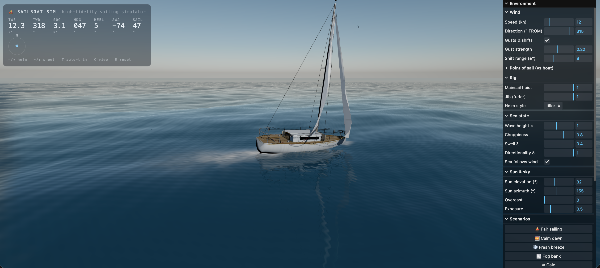

# ⛵ Sail Simulator

A high-fidelity, browser-based sailboat simulator built with **Three.js** (WebGL)
and **Rapier** (WASM rigid-body physics). It models an ocean with real FFT
wave spectra, a sailing hull with sampled-column buoyancy and cloth sails, and
a physically-based sky with dynamic weather — all running in real time in the
browser, no install or asset downloads required.

> Private repository.

---

## Features

- **Realistic ocean** — FFT wave simulation with real-time buoyancy and physical whitecap foam.
- **Boat physics** — rigid-body hull that rides, heels, and knocks down in the waves.
- **Cloth sails** — main and jib simulated as cloth that luffs, fills, and trims like the real thing.
- **Dynamic weather** — sky, clouds, rain, and thunderstorms with lightning and thunder.
- **Effects** — bow spray, spindrift, breaking waves, birds, and marine life.
- **Procedural audio** — live wind, sea, rain, rig creaks, and thunder.
- **First-person helm** — walk the deck and drag the rigging to trim the sails.
- **Reflections** — the boat and sky mirror in the water.
- **Scenarios** — one-click presets from calm dawn to hurricane and rogue wave.

---

## Screenshots



---

## Controls

| Key | Action |
| --- | --- |
| `←` / `→` | Rudder (self-centres on release) |
| `↑` / `↓` | Sheet in / ease out (manual trim) |
| `T` | Toggle auto-trim |
| `C` | Toggle first-person (helm-seat) camera |
| `F` | Toggle clean full-screen view (hide overlays) |
| `R` | Reset the boat |
| Mouse drag | Grab sheets / halyard in first-person to trim & reef |
| Mouse | Orbit / zoom in chase view |

A live control panel (top-right) exposes wind, sun, sky, sail, and scenario
controls, plus debug visualisations.

---

## Running locally

```bash
npm install
npm run dev        # dev server with hot-reload
```

Then open the printed `http://localhost:5173` URL.

To serve a production build:

```bash
npm run build
npm run preview
```

---

## Project structure

```
src/
  main.js              bootstrap + render loop, post-processing, HDR/ACES
  ocean/               FFT + Gerstner wave fields, foam, reflections
  boat/                hull, physics, cloth sails, rigging, textures
  effects/             spray, runoff, spindrift, breakers, birds, marine life
  environment/         sky/atmosphere, clouds, planar reflection, thunderstorm
  wind/                wind field + direction
  audio/               procedural sound synthesis
  ui/                  control panel, HUD, helm, rig interaction
  physics/             Rapier world wrapper
```

---

## Tech

- [Three.js](https://threejs.org/) — WebGL rendering, post-processing
- [@dimforge/rapier3d-compat](https://rapier.rs/) — rigid-body physics (WASM)
- [Vite](https://vitejs.dev/) — dev server & bundler
- [lil-gui](https://lil-gui.georgealways.com/) — debug/control panel
